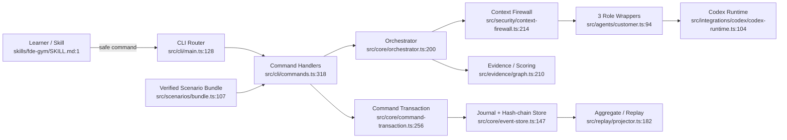

# FDEGym 功能边界

> 证据基线：2026-08-29。仅描述当前源码，不包含 `dist/`、`node_modules/` 或生成的 `.fde-gym/` 状态。

## 1. 学习者入口与命令路由

- **目的**：把 Skill/终端意图收敛为严格 CLI 参数、JSON stdin 与 learner-safe 输出信封。
- **入口**：`src/cli/main.ts:128-390` (`main`)
- **核心**：`src/cli/commands.ts:318-909`；`src/cli/render.ts:413-451`
- **边界理由**：这里只做输入解析、命令分派、错误本地化和安全输出；业务编排下沉到 orchestrator/transaction。

## 2. 场景供应链与完整性封装

- **目的**：将双语 YAML 编译为 public/customer/evaluator/events 四分区，并以 manifest + SHA-256 封装。
- **入口**：`src/scenarios/compiler.ts:202-307` (`compileScenario`)
- **运行时入口**：`src/scenarios/bundle.ts:107-243` (`loadScenarioBundle`)
- **核心**：`src/scenarios/schema.ts:1-430`；`src/scenarios/compiler.ts:151-191`
- **边界理由**：编译时 authoring YAML 与运行时已验证 bundle 明确分离；角色从不直接读取 YAML。

## 3. 训练运行控制面

- **目的**：维护 SCENARIO → DISCOVERY → … → REVIEW/RETRY 的阶段门控，并把领域动作转换为事件。
- **入口**：`src/core/state-machine.ts:29-144` (`decide`)
- **业务编排**：`src/core/orchestrator.ts:200-1185`
- **命令接入**：`src/cli/commands.ts:318-819`
- **边界理由**：`decide` 保持纯函数；含模型调用、结构门与事件组装的流程位于 orchestrator。

## 4. 发现、证据与挑战模拟

- **目的**：执行提问→客户回复→证据抽取→图更新；并按种子与触发上下文注入挑战。
- **入口**：`src/core/orchestrator.ts:200-379` (`prepareDiscoveryTurn`, `prepareRepairPendingEvidence`)
- **证据图**：`src/evidence/graph.ts:210-280` (`applyEvidencePatch`，后续校验延续至文件末尾)
- **挑战入口**：`src/core/orchestrator.ts:726-862`
- **调度**：`src/simulation/event-scheduler.ts:1-88`；`src/simulation/rng.ts:1-45`
- **边界理由**：证据图与调度都是确定性控制面；角色只提供受 schema 约束的 patch/判断。

## 5. 角色运行时与上下文安全

- **目的**：按 Customer / Evidence Tracker / Coach 三角色构造 allowlist 输入，在新鲜 Codex 会话中运行，并对输出做 schema/canary 防护。
- **抽象入口**：`src/agents/agent-runtime.ts:39-45`
- **防火墙**：`src/security/context-firewall.ts:214-367` (`buildRoleInput`)
- **角色包装器**：`src/agents/customer.ts:94-126`；`src/agents/evidence-tracker.ts:91-126`；`src/agents/coach.ts:140-241`
- **真实运行时**：`src/integrations/codex/codex-runtime.ts:84-256`
- **输出守门**：`src/security/sanitizer.ts:74-110`
- **边界理由**：这是隐藏 capsule 与 learner-safe 控制面的信任边界；字段逐项构造、未知字段 fail closed。

## 6. 事务、事件存储与恢复

- **目的**：用 write-ahead command journal、跨进程 run lock、原子写和哈希链提供幂等、恢复与防篡改。
- **事务入口**：`src/core/command-transaction.ts:256-317` (`executeCommandTransaction`)
- **事件写入**：`src/core/event-store.ts:147-218` (`appendEvents`)
- **读取校验**：`src/core/event-store.ts:301-377` (`readEventsAndPrefix`)
- **锁/原子写**：`src/storage/run-lock.ts:36-196`；`src/storage/atomic-file.ts:14-44`
- **边界理由**：所有变更命令通过同一个事务入口；模型不会直接写 run 状态。

## 7. 评审、评分与学习者画像

- **目的**：Coach 产出最终评审；控制面从已提交事件与 capsule 派生输入、计算确定性分数并 exactly-once 更新画像。
- **评审入口**：`src/core/orchestrator.ts:1123-1185` (`prepareReview`)
- **评分输入**：`src/scoring/score-input.ts:226-334`
- **公式**：`src/scoring/formulas.ts:142-226`
- **画像**：`src/profile/learner-profile.ts:170-215`；`src/storage/fs-store.ts:52-95`
- **边界理由**：模型提供 criterion judgment；最终公式、pass gates、EMA 和 comparability guard 均为确定性代码。

## 8. 重放、重试与运行诊断

- **目的**：从提交事件重建 aggregate/learner-safe replay；创建干净子运行；探测 Codex strict-mode 能力。
- **重建**：`src/replay/projector.ts:182-282` (`foldRunAggregate`)
- **重放**：`src/replay/projector.ts:301-451` (`projectReplay`)
- **重试**：`src/core/orchestrator.ts:982-1077`；`src/cli/commands.ts:771-819`
- **诊断**：`src/integrations/codex/capability-probe.ts:380-614`；`src/cli/commands.ts:899-909`
- **边界理由**：运行恢复与产品释放门都从持久事实或实机 probe 得出，不依赖内存会话。

## 总体边界图

## 置信度与缺口

- **置信度：高**。入口、事务边界、角色调用链、存储与评分均从实现读取并交叉核对 `README.md` 与 `docs/architecture.md`。
- **已知缺口**：测试矩阵与所有 Zod schema 未逐项展开；HTML 聚焦运行机制，不列举每个事件字段。
- **运行状态注意**：当前工作区的 Codex strict-mode 文件存在未提交修改；本图描述读取到的工作区版本，而非仅 `main` 提交版本。
