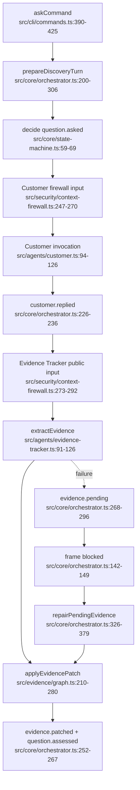

# 发现回合与证据图

- Side effects: two isolated model invocations; accepted events journaled as one command plan.
- The customer reply survives tracker failure; only evidence progression is blocked.
- Dependency: role runtime/security, evidence graph reducer, event transaction.
