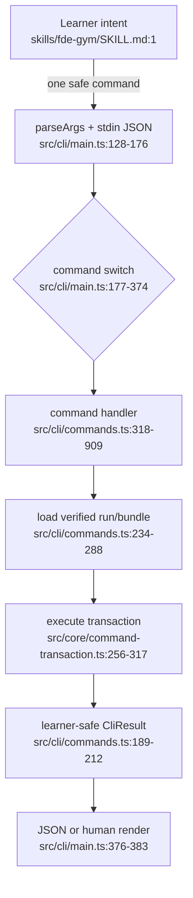

# 学习者命令流

- Side effects: stdin read, run/bundle file reads, transaction writes, stdout.
- Error branch: all handler errors collapse through `guard`/`toFailure` (`src/cli/commands.ts:298-305`).
- Dependency: control-plane orchestrator, transaction store, Codex runtime.
