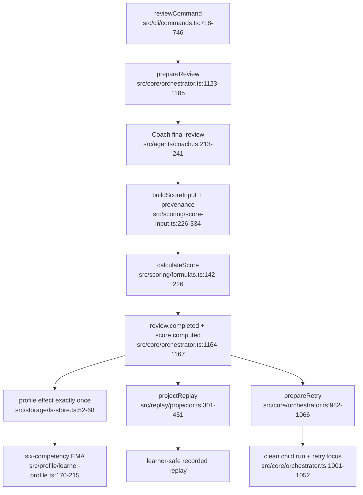

# 评审、评分、画像与重放

- Coach judgment is non-deterministic; score formulas, provenance, EMA and replay projection are deterministic.
- Retry clears graph/transcript/disclosure/hints while retaining 2–3 learner-visible focus summaries.
- Dependency: event stream is the source of truth for aggregate, replay and score input.
