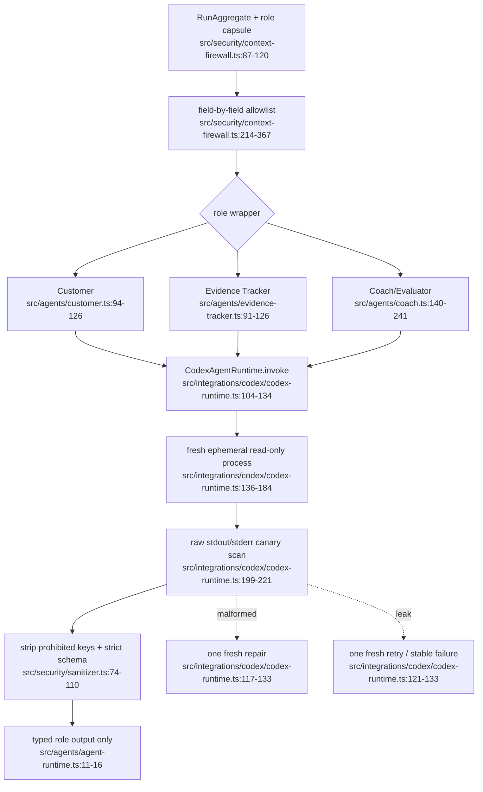

# 角色运行时与安全边界

- Process boundary: each role attempt gets a unique workdir and ephemeral Codex session.
- Trust boundary: customer/evaluator capsules are discriminated and cross-role delivery fails closed.
- Dependency: capability probe defines the child process runner and environment sanitizer.
