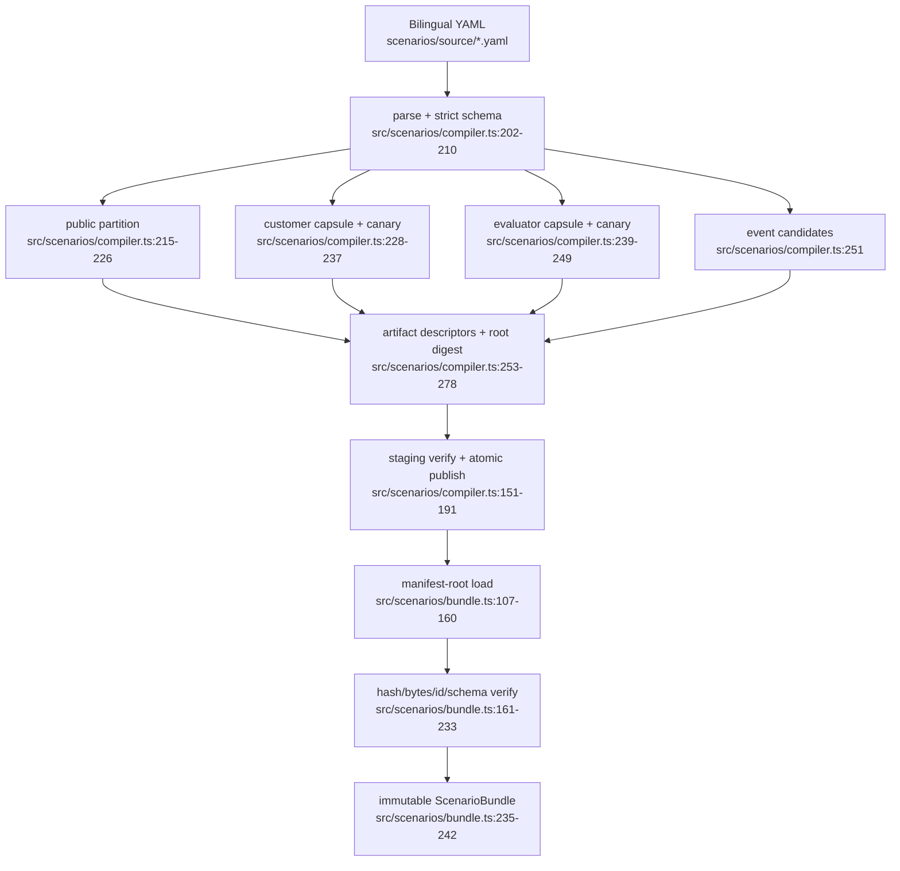

# 场景供应链

- Side effects: build-time file reads/writes, atomic directory rename.
- Fail-closed branches: manifest digest mismatch, traversal, missing/extra artifacts, schema/version mismatch.
- Dependency: Zod schemas and canonical JSON hashing.
