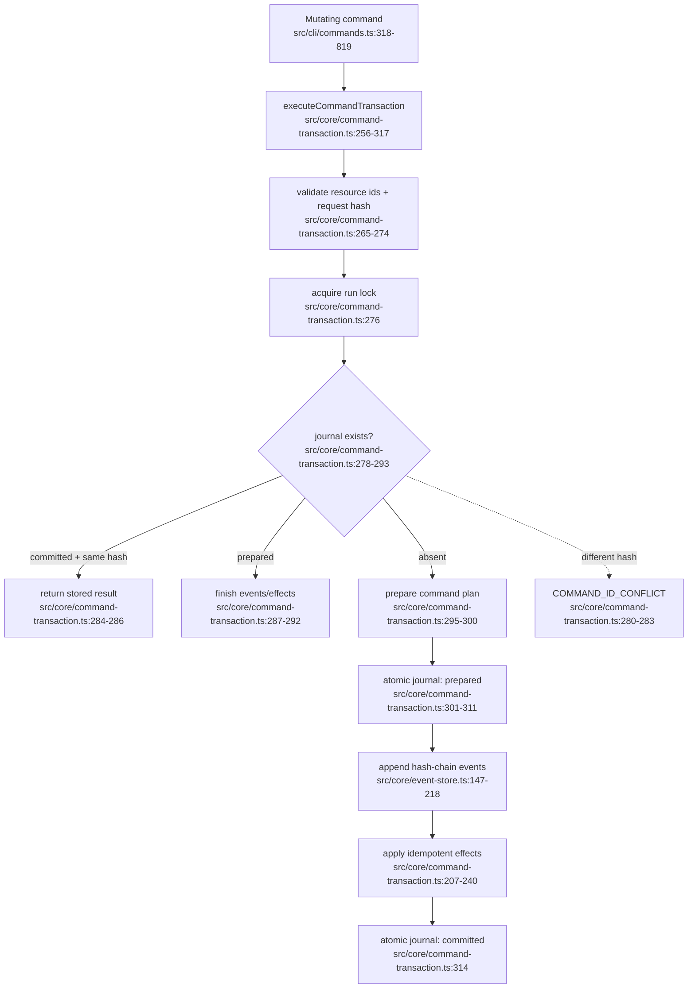

# 命令事务与事件持久化

- Durable files: `commands/<commandId>.json`, `events.jsonl`, `manifest.json`, optional `profile.json`/child run.
- Recovery never re-invokes the model once a prepared plan is journaled.
- Dependency: atomic file replacement and lexicographically ordered locks.
