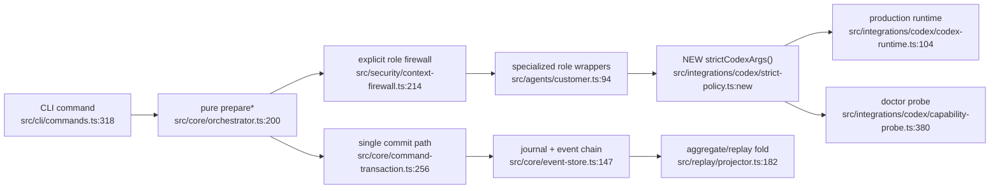

# 最简统一架构建议

> 这里描述“应该如何收敛”，不代表已实现。

## 提案 A：单一 Strict Codex Policy

- **组件**：`StrictCodexPolicy`
- **单一入口**：建议放在 `src/integrations/codex/strict-policy.ts`，导出 `strictCodexArgs()` 与必要的环境策略常量。
- **旧调用点**：
  - `src/integrations/codex/codex-runtime.ts:73-82` 改为调用单一入口。
  - `src/integrations/codex/capability-probe.ts:443-453` 改为调用同一入口。
- **能力损失**：无。probe 的 `tools:false` 负向测试仍可显式不追加该参数。
- **约束**：不要注册表、工厂、feature flag；不要让 probe 与 production 接受不同默认值。

## 提案 B：单一持久化命令路径

- **组件**：`executeCommandTransaction`
- **单一入口**：保留 `src/core/command-transaction.ts:256-317` 为所有生产变更的唯一提交路径。
- **旧调用点**：
  - CLI 已正确：`src/cli/commands.ts:318-819`。
  - 审核 `src/core/orchestrator.ts:313-319`, `373-379`, `490-494`, `641-647`, `780-785`, `857-862`, `916-920`, `1069-1077` 的直接持久化包装器；移出生产 API 或删除。
- **能力损失**：直接调用 orchestrator 并落盘的便利性会减少；测试可组合 `prepare*` + 测试 store helper。
- **收益**：write-ahead journal、恢复、幂等 result replay、canary journal scan 和 effects 语义始终存在。
- **约束**：不要保留旧路径 behind flag；不要新增第二种 transaction adapter。

## 保留的边界

- 三角色 wrapper 保持独立，避免动态角色注册。
- runtime 与 wrapper 的双重 sanitize 保持不变。
- `decide/reduce` 与 `foldRunAggregate` 保持不同高度，但通过事件契约测试绑定。

## 统一后的机制图

