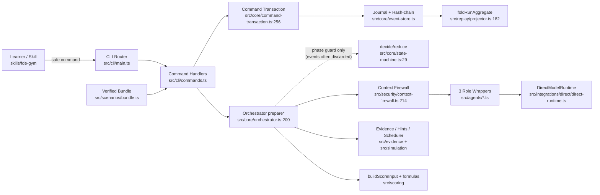

# FDEGym 功能边界（第一性原理）

> 证据基线：2026-08-30（main @ `06a9ff6`）。仅描述当前源码；已对照并 supersede `PATHFINDER-2026-08-29`（后者仍引用已删除的 Codex role runtime / doctor）。
>
> 产品第一性原理（来自 `docs/architecture.md` + ADR-0001/0002）：
> 1. **确定性控制面**包住 **角色作用域的模型调用**；
> 2. 模型 prose 永不驱动控制面决策；
> 3. 隐藏 capsule 与 learner-safe 输出之间是 fail-closed 分区；
> 4. 同一事件日志 → 同一状态 / 同一 replay 字节。

## 边界清单

### 1. learner-cli-surface

- **目的**：把 Skill/终端意图收敛为严格 CLI 参数、JSON stdin 与 learner-safe 输出信封。
- **入口**：`src/cli/main.ts:77` (`resolveDefaultRuntime`)；`src/cli/main.ts` 命令路由。
- **核心**：`src/cli/commands.ts`（~893 行）；`src/cli/render.ts`；`skills/fde-gym/`；`src/integrations/codex/install-skill.ts`。
- **边界理由**：只做解析、分派、本地化、安全输出；业务编排下沉。
- **规模**：~5 源文件 + skill 包。

### 2. scenario-supply-chain

- **目的**：双语 YAML → public/customer/evaluator/events 四分区 + manifest SHA-256 封装。
- **入口**：`src/scenarios/compiler.ts` (`compileScenario`)；运行时 `src/scenarios/bundle.ts` (`loadScenarioBundle`)。
- **核心**：`src/scenarios/schema.ts`；`src/scenarios/hint-discipline.ts`；`src/scenarios/loader.ts`；`scenarios/source/`、`scenarios/compiled/`。
- **边界理由**：authoring 与 verified bundle 分离；角色从不读 YAML。
- **规模**：~5 源文件 + 5 生产场景。

### 3. phase-decision-kernel

- **目的**：理论上的纯 `decide()`/`reduce()` 阶段门控。
- **入口**：`src/core/state-machine.ts:29` (`decide`)；`src/core/reducer.ts:25` (`reduce`)。
- **核心**：`src/core/domain.ts`（命令/事件联合）；`src/core/errors.ts`。
- **边界理由**：文档声称这是控制面核心；**实现上该层对结构门几乎是空壳**（见 duplication report）——真实门控在 orchestrator。
- **规模**：~4 文件，`domain.ts` 915 行占主导。

### 4. command-orchestration

- **目的**：固定流水线：模型调用 → 结构校验 → 事件组装 →（可选）直接 append。
- **入口**：`src/core/orchestrator.ts:200+` 全部 `prepare*`。
- **核心**：同一文件的 `run*`/`submit*`/`createRetry` 直接持久化包装器。
- **边界理由**：含副作用与多步门控的唯一业务编排层；CLI 只应调用 `prepare*`。
- **规模**：1 文件，1185 行（仓库最大模块）。

### 5. role-runtime-security

- **目的**：三角色 allowlist 输入 → 无工具 direct chat-completions → 输出清洗/canary。
- **入口**：`src/agents/agent-runtime.ts:40` (`AgentRuntime`)；`src/security/context-firewall.ts:214` (`buildRoleInput`)。
- **核心**：`src/agents/{customer,evidence-tracker,coach}.ts`；`src/integrations/direct/direct-runtime.ts`；`src/security/sanitizer.ts`；`src/agents/output-validation.ts`；`src/agents/contracts.ts`；`resources/prompts/`。
- **边界理由**：信任边界；字段逐项构造、未知字段 fail-closed。
- **规模**：~12 文件。**注意**：`coach.requestHint` 生产路径已死（ADR-0003）。

### 6. evidence-and-simulation

- **目的**：证据图 patch、brief 结构门、种子挑战调度、确定性 hint ladder。
- **入口**：`src/evidence/graph.ts` (`applyEvidencePatch`)；`src/evidence/brief-validator.ts`；`src/simulation/event-scheduler.ts`；`src/simulation/hints.ts:72`。
- **核心**：`src/simulation/rng.ts`。
- **边界理由**：全部为确定性控制面子域；角色只提供 schema 约束的 patch/判断。
- **规模**：~5 文件。

### 7. transaction-event-store

- **目的**：write-ahead journal、跨进程 lock、哈希链 append-only、幂等 result replay。
- **入口**：`src/core/command-transaction.ts:256` (`executeCommandTransaction`)。
- **核心**：`src/core/event-store.ts`；`src/storage/{run-lock,atomic-file,fs-store}.ts`；`src/core/versioning.ts`。
- **边界理由**：所有生产变更的唯一合法提交路径（理想态）；模型不写 run 状态。
- **规模**：~6 文件。

### 8. scoring-and-profile

- **目的**：从已提交事件 + Coach criterionScores 派生确定性分数与 exactly-once 画像更新。
- **入口**：`src/scoring/score-input.ts:226` (`buildScoreInput`)；`src/scoring/formulas.ts`；`src/profile/learner-profile.ts`。
- **核心**：`src/scoring/{rubric,provenance}.ts`。
- **边界理由**：模型给判断；公式/pass gates/EMA 为代码。
- **规模**：~5 文件。含 legacy fallback 复杂度。

### 9. replay-and-aggregate-fold

- **目的**：从事件重建完整 `RunAggregate` 与 learner-safe replay。
- **入口**：`src/replay/projector.ts:182` (`foldRunAggregate`)；`src/replay/projector.ts` (`projectReplay`)。
- **核心**：`src/security/public-projection.ts`。
- **边界理由**：恢复 = 重放；与最小 `RunState` reduce 高度不同。
- **规模**：~2–3 文件。**注意**：`RunAggregate` 类型却定义在 `context-firewall.ts`（归属错位）。

## 跨切基础设施（非独立 feature）

| 关注点 | 位置 | 说明 |
|---|---|---|
| 全域 schema 袋 | `src/core/domain.ts` (915) | 命令/事件/工件/分数共居一文件 |
| 内部聚合类型 | `src/security/context-firewall.ts:87` | 安全模块承载领域聚合 |
| 基目录解析 | `src/base-dir.ts`、`event-store.resolveBaseDir` | 运行数据根 |
| 发布门 | `scripts/release-gate.mjs` | ci → typecheck → build → test（doctor 已退役） |

## 总体边界图（当前实现）

## 与 2026-08-29 的差异

- **删除**：Codex role runtime、strict-policy、capability-probe、doctor（ADR-0002）。
- **新增关注**：`decide()` 空壳化、Coach model-hint 死路径、`RunAggregate` 归属、legacy score fallback、CLI/orchestrator 样板膨胀。
- **仍有效**：单一持久化路径收敛（prepare* + transaction only）。

## 置信度与缺口

- **置信度：高**（核心路径已读源码并交叉 README/ADR/architecture）。
- **已知缺口**：未逐行展开全部 Zod 字段与全部 e2e fixture；流程图 Phase 1 补齐调用链细节。
