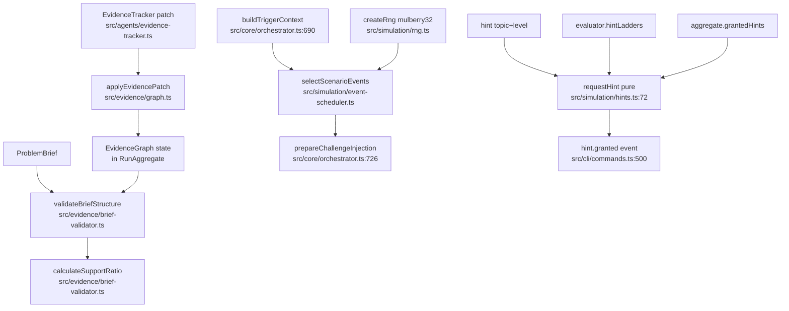

# Flow: evidence-and-simulation

## Happy paths

## Side effects
- None of these modules I/O themselves; orchestrator/CLI persist events
- Hints never enter evidence graph or Customer context (by design)

## Dead / dual path
- `src/agents/coach.ts` also exports `requestHint` (model path) — production CLI uses pure `simulation/hints.ts` only (ADR-0003)

## External deps
- Orchestrator discovery/framing/challenge
- CLI hintCommand
