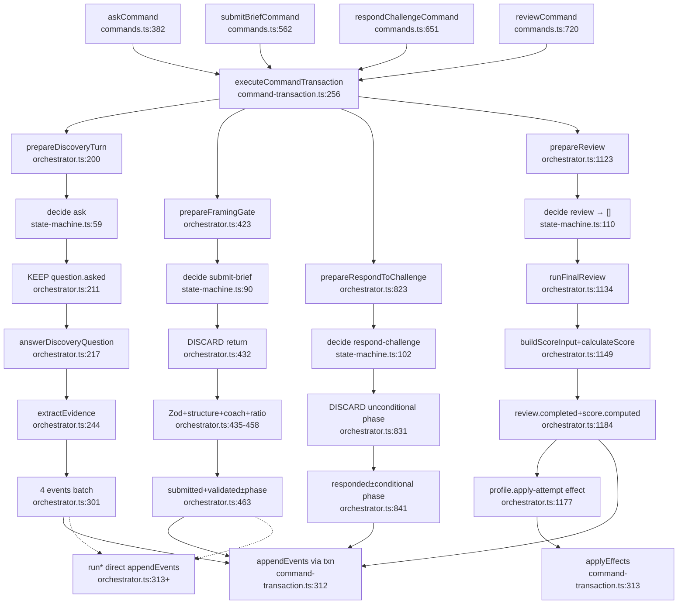

# Flow: phase-decision-kernel + command-orchestration

## Architecture one-liner

`decide()` is a **phase guard + collapsed success path**; the orchestrator **re-implements richer multi-step event batches**, often **discarding** `decide()`’s returned events; CLI persists via `executeCommandTransaction` (not the `run*` wrappers).

## decide vs orchestrator emission matrix

| Command | Phase in | `decide()` returns | Orchestrator happy emits | decide used as |
|---------|----------|--------------------|--------------------------|----------------|
| `ask` | DISCOVERY | `question.asked` | `question.asked` + `customer.replied` + `evidence.patched` + `question.assessed` | **source of first event** |
| `submit-brief` | PROBLEM_FRAMING | `phase.changed→SOLUTION_DESIGN` | `brief.submitted` + `brief.validated` + optional `phase.changed` | **guard only (DISCARDED)** |
| `respond-challenge` | CHALLENGE | `phase.changed→PITCH` | `challenge.responded` + optional `phase.changed` | **guard only (DISCARDED)** |
| `review` | REVIEW | `[]` | `review.completed` + `score.computed` (+ profile effect) | **guard only (empty)** |
| `submit-design` | SOLUTION_DESIGN | `phase.changed→CHALLENGE` | `design.submitted` + `phase.changed` | **DISCARDED** |
| `submit-pitch` | PITCH | `phase.changed→REVIEW` | `pitch.submitted` + `phase.changed` | **DISCARDED** |
| `hint` | D/PF | `hint.granted` w/ **placeholder text** | CLI bypasses decide; uses pure `simulation/hints` | **dead if used** |

## Mermaid



## Side-effect summary

```
prepare*  = plan (may call models) → { acceptedEvents, effects? }
run*      = prepare* + appendEvents   // bypass journal
CLI path  = prepare* inside executeCommandTransaction
```

## External deps

- agents (customer, evidence-tracker, coach)
- evidence graph + brief-validator
- scoring formulas + score-input
- command-transaction + event-store
- RunAggregate from context-firewall
- scenario capsules via CLI resolveScenario

## Confidence: high

Sources: state-machine.ts, reducer.ts, orchestrator.ts key ranges, commands.ts call sites, command-transaction.ts.
