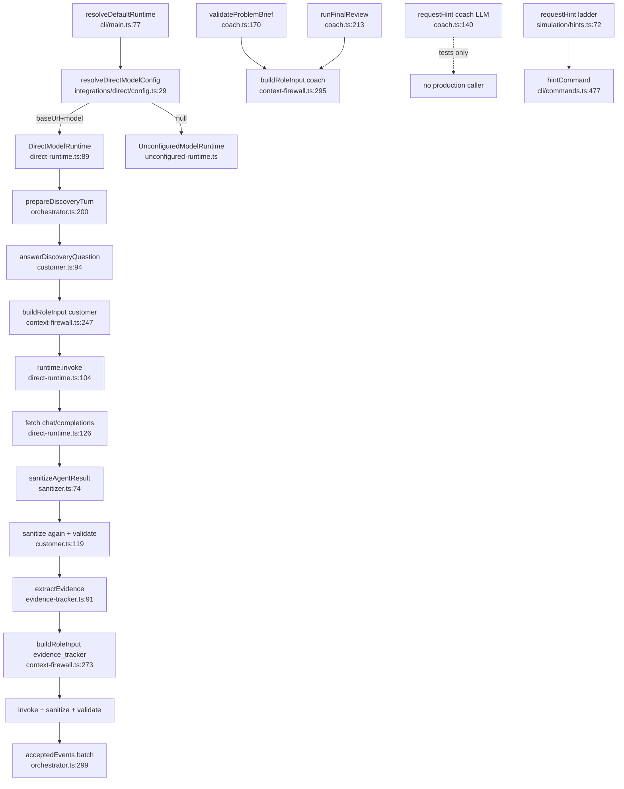

# Flow: role-runtime-security

## Cross-cutting

- **Production hints**: pure `simulation/hints.ts` only — NOT `coach.requestHint`
- **RunAggregate**: defined `context-firewall.ts:87`; folded `projector.ts:182`; live-mutated in orchestrator

## Happy path (discovery ask)

## Side effects
- HTTP POST model endpoint
- Read prompt templates (cached)
- Role wrappers themselves do no durable I/O

## External deps
- zod, fetch, env `FDE_GYM_MODEL_*`, optional ~/.codex/config.toml for endpoint discovery

## Confidence: high
