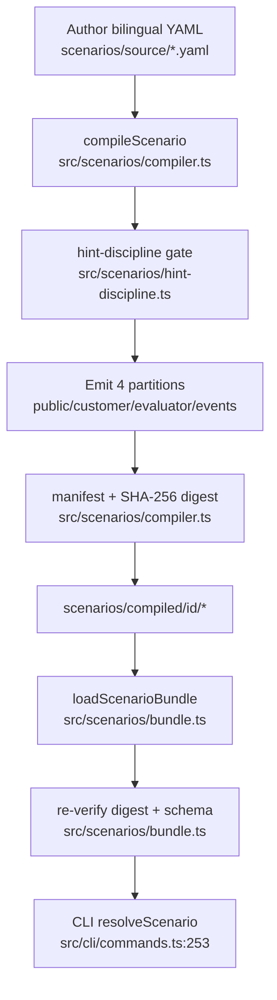

# Flow: scenario-supply-chain

## Happy path

## Side effects
- Compile writes files under `scenarios/compiled/`
- Runtime load is read-only + hash verify
- Digest mismatch → `SCENARIO_BUNDLE_MISMATCH`

## External deps
- Consumed by CLI start/ask/review paths
- Capsules fed to firewall / orchestrator only via resolved partitions

## Notes
- ADR-0004 froze five AI-agent production ids
- Tools exist only as authored facts; gym never executes CRM/SQL/Git/OCR
