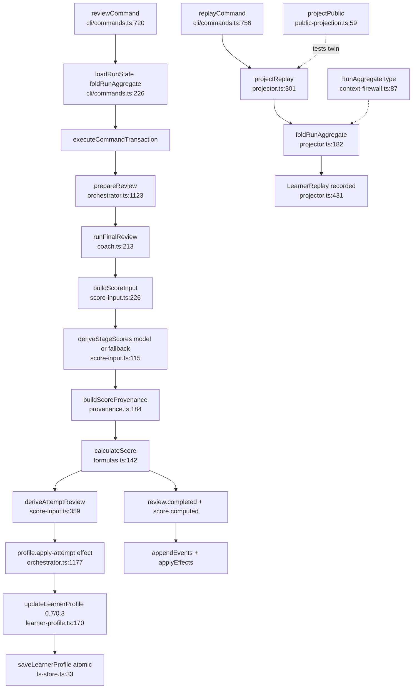

# Flow: scoring-profile-replay

## Happy path

## Notes
- Score stage dual path: Coach criterion preferred; deterministic fallback if missing; provenance records which
- `projectPublic` not used by CLI today; discipline twin of projector
- Model never owns numeric weights

## Confidence: high
