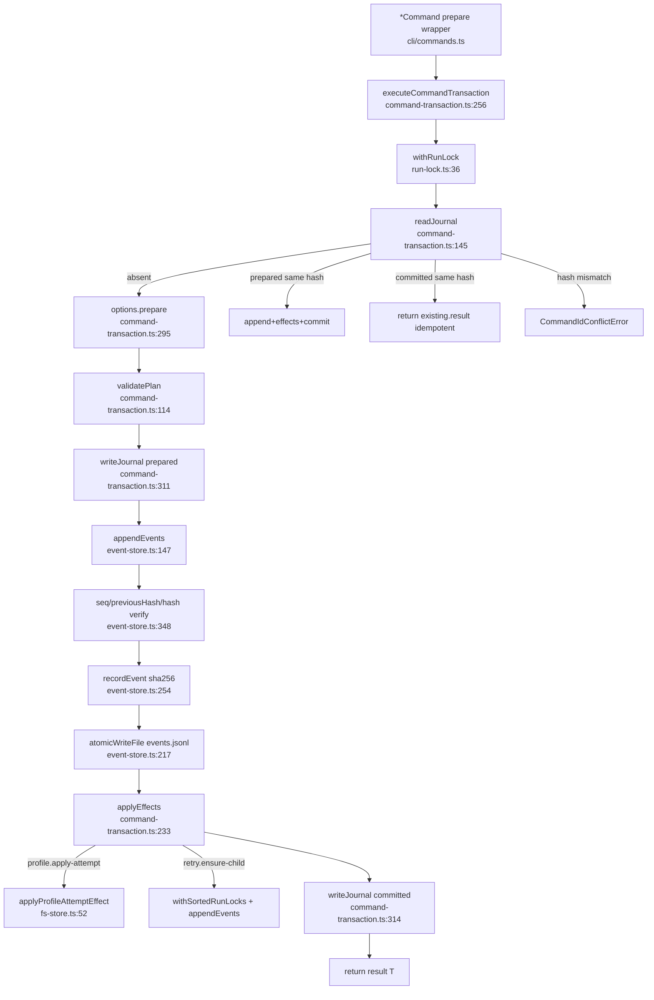

# Flow: transaction-event-store

## Happy path

```mermaid
flowchart TD
  CLI["*Command prepare wrapper<br/>cli/commands.ts"] --> Txn["executeCommandTransaction<br/>command-transaction.ts:256"]
  Txn --> Lock["withRunLock<br/>run-lock.ts:36"]
  Lock --> ReadJ["readJournal<br/>command-transaction.ts:145"]
  ReadJ -->|absent| Prep["options.prepare<br/>command-transaction.ts:295"]
  Prep --> Val["validatePlan<br/>command-transaction.ts:114"]
  Val --> WPrep["writeJournal prepared<br/>command-transaction.ts:311"]
  WPrep --> Append["appendEvents<br/>event-store.ts:147"]
  Append --> HashChk["seq/previousHash/hash verify<br/>event-store.ts:348"]
  HashChk --> Rec["recordEvent sha256<br/>event-store.ts:254"]
  Rec --> AtomE["atomicWriteFile events.jsonl<br/>event-store.ts:217"]
  AtomE --> Fx["applyEffects<br/>command-transaction.ts:233"]
  Fx -->|profile.apply-attempt| Prof["applyProfileAttemptEffect<br/>fs-store.ts:52"]
  Fx -->|retry.ensure-child| Child["withSortedRunLocks + appendEvents"]
  Fx --> WComm["writeJournal committed<br/>command-transaction.ts:314"]
  WComm --> Done["return result T"]
  ReadJ -->|prepared same hash| Resume["append+effects+commit"]
  ReadJ -->|committed same hash| Replay["return existing.result idempotent"]
  ReadJ -->|hash mismatch| Conflict["CommandIdConflictError"]
```

## Side effects
- locks, journals, events.jsonl, manifest, profile.json, child run events

## Confidence: high
