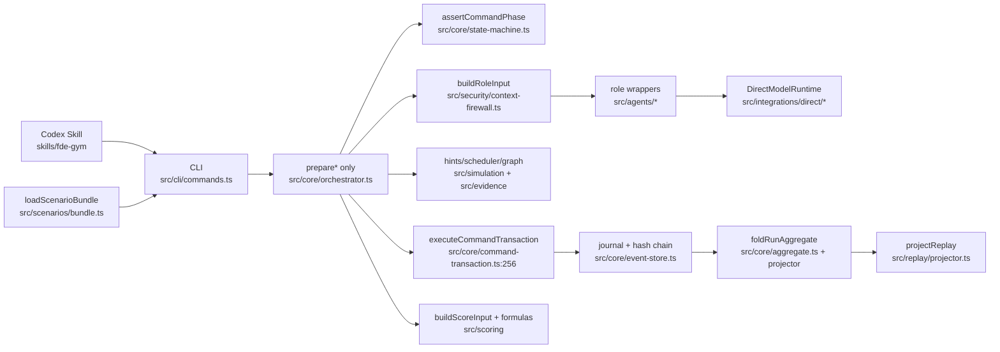

# 最简统一架构建议

> 描述“应该如何收敛”，不代表已实现。原则：**删除优于抽象**；**一个权威优于 dual-path**；不引入 registry/factory/feature flag。

---

## 第一性原理回顾

产品真正需要的不变式只有四条：

1. **命令 → 事件批次 → 原子提交**（journal + hash chain）
2. **阶段与结构门是确定性的**（模型不决策是否过门）
3. **角色输入/输出 fail-closed 分区**（firewall + sanitizer）
4. **同一事件日志 → 同一聚合 / 同一 replay 字节**

当前实现用过多层“近似权威”表达这四条，导致心智与代码分叉。

---

## 提案 1：单一决策权威（最高优先）

### 目标形态

```
CLI → prepareCommand(aggregate, command, deps)
        → 结构门 + 可选模型调用
        → { events, effects, result }
    → executeCommandTransaction(...)
```

`decide(RunState)` **不再产生业务事件**。两种等价收敛（选更便宜的）：

| 选项 | 做法 | 取舍 |
|---|---|---|
| **1a 降级（推荐）** | `decide` → `assertCommandPhase(phase, type)` 只 throw；所有事件由 `prepare*` 显式组装 | 改动小；删除 placeholder/假 phase.changed |
| **1b 升级** | `decide(aggregate, command, ctx) → events` 吃完整聚合并含结构门 | 更“教科书 event-sourcing”，但要把 Coach/Customer 调用边界想清楚（模型 I/O 不宜进纯 decide） |

**推荐 1a**：模型 I/O 与纯函数本就不应同层；orchestrator 已是真权威，承认它即可。

### 调用点改写

- `orchestrator.ts:432,623,831,898,1131`：`decide(...)` → `assertCommandPhase(...)`
- `orchestrator.ts:211`：ask 的 `question.asked` 由 prepare 显式构造（与 reply 同批），不再从 decide 取
- `state-machine.ts:75-88`：删除 hint placeholder 事件路径
- `cli/commands.ts` start/frame 等仍可用极薄 phase helper 生成 `run.started`/`phase.changed`

### 能力损失

无。测试若断言 decide 返回 phase.changed，改为断言 prepare 批次或 assert 抛错。

### 反模式

- 不要 `decide` 与 `prepare` 双写同一事件
- 不要 feature-flag 保留旧 decide 事件语义

---

## 提案 2：单一持久化路径

- **唯一入口**：`executeCommandTransaction`（`command-transaction.ts:256`）
- **删除或 test-only**：`runDiscoveryTurn`、`repairPendingEvidence`、`runFramingGate`、`submitSolutionDesign`、`runChallengeInjection`、`respondToChallenge`、`submitPitch`、`createRetry` 中的 `appendEvents` 包装
- 测试：`prepare*` + 内存/临时 store 的 transaction helper

### 反模式

- 不要第二种 transaction adapter
- 不要 flag 保留双路径

---

## 提案 3：单一 Hint 路径（对齐 ADR-0003）

- **保留**：`simulation/hints.ts` `requestHint` + CLI `hintCommand`
- **删除**：
  - `agents/coach.ts` `requestHint`
  - firewall `coachTask: "hint"` 分支与 `CoachHintInput/Output`（若无其它消费者）
  - `decide` hint 分支
- 测试：`coach-agent` 去掉 hint case；`context-firewall` hint case 删除或改 brief/final-review

### 能力损失

无生产能力损失。模型动态生成 hint 本就不支持。

---

## 提案 4：RunAggregate 归位

- 新建 `src/core/aggregate.ts`（或并入 domain 旁）
- 移动 `RunAggregate` + schema 中**非敏感**字段
- 删除未使用敏感占位：`groundTruth`、`chainOfThought`、`customerPrompt`、`customerSessionId`、`rawCustomerOutput`（确认 fold/projector 不写后再删）
- `context-firewall` 只 import 类型并 `buildRoleInput`

### 反模式

- 不要为“将来可能”保留 unknown 敏感槽位；需要时再加字段并更新 firewall 白名单测试

---

## 提案 5：文档与验收基线对齐

- `docs/mvp-acceptance.md`：去掉 doctor/CodexAgentRuntime 行；改为 direct-runtime + release:gate
- README：补 `repair-evidence`
- 归档或标注 obsolete：`docs/superpowers/specs/2026-08-29-codex-strict-mode-*`
- 冻结“legacy score fallback”日落策略（有无场上 pre-Task8 run？）

---

## 提案 6（可选）：CLI 去样板

```ts
async function withMutatingCommand<T>(ctx, args, request, canaries, prepare): Promise<CliResult<T>>
```

不引入命令总线框架；只是把 `loadRunState/guard/txn/ok` 收一层。

---

## 明确不统一

| 项 | 原因 |
|---|---|
| 三角色 wrapper | 安全边界可读性 > DRY |
| runtime + wrapper 双 sanitize | defense-in-depth |
| public-projection vs firewall allowlist | 方向相反的显式分区 |
| formulas 与 Coach criterionScores | 模型判断 vs 确定性权重 |

---

## 统一后的机制图



---

## 建议落地顺序

1. **提案 2**（删 append 旁路）— 低成本、锁不变量  
2. **提案 3**（删 model-hint）— 低成本、ADR 对齐  
3. **提案 1a**（decide 降级）— 中成本、心智统一  
4. **提案 4**（aggregate 归位）— 低成本移动  
5. **提案 5**（文档）— 随时可做  
6. **提案 6**（CLI 样板）— 有空再做  

**刻意不做**：抽象 `RoleAgentFactory`、通用 workflow engine、把模型调用塞进纯 `decide`。
