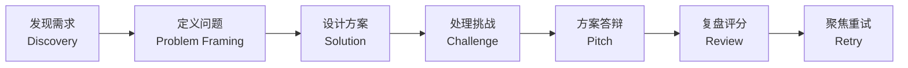

# FDE Gym

> 在安全、可回放的 AI 客户模拟中，练习从需求发现到方案答辩的完整 FDE 工作流。

*An evidence-driven FDE training gym with role-isolated AI customers, deterministic
workflows, secure evaluation, and replayable practice.*

FDE Gym 是面向 **Forward-Deployed Engineer** 和 **Applied AI Engineer** 的实战训练场。

你将面对一个信息不完整、存在利益冲突和隐藏约束的 **AI 客户**，通过提问发现事实、
用证据定义问题、设计方案、处理挑战并完成 Pitch。整个过程可评分、可回放，Review 之后
可以针对薄弱能力开启一轮干净的聚焦重训。

## 30 秒训练体验（示意）

下面是学习者视角的一次典型交互，取材自 `customer-support-agent` 场景的**公开内容**
（`openingRequest` 与 `visibleConstraints`），用于直观感受产品形态——它不是某次真实
运行的逐字输出，也不包含任何隐藏事实、评分标准（rubric）或 canary。

```text
客户（opening request）：
  “请帮助我们设计一个会调用业务系统工具的客服代理，自动处理大部分请求，
   并在敏感操作上保留人工。”

你（ask）：
  “哪些操作算‘敏感’？代理自动处理失败时会产生什么业务影响？”

客户（逐步披露）：
  “付款、退款和账户变更必须先人工确认（HITL）；客服工单数据不得发送到境外第三方模型。”

证据追踪器（Evidence Tracker）：
  ✓ 已确认   付款/退款/账户变更需要 HITL
  ✓ 已确认   工单数据不得出境
  ? 待确认   允许代理调用的具体工具边界
  ! 缺少证据  “全部自动化”的主张尚无对话证据
```

关键点：你**不会**看到评分标准、得分或任何提示——它们对客户角色之外的所有方都不可见。

## 完整学习流程



每一阶段都有确定性门槛：例如问题定义中的关键主张必须得到对话证据支持，才能进入方案
设计。`Retry` 会开启一个针对薄弱能力的、干净的聚焦子 run，回到 `Discovery` 重新开始。

## 三个隔离角色

| 角色 | 职责 | 不可见信息 |
|---|---|---|
| **Customer**（客户） | 根据你的提问逐步披露客户事实 | 评分标准、得分、提示 |
| **Evidence Tracker**（证据追踪器） | 整理主张、证据和缺口 | 客户隐藏事实、评估答案 |
| **Coach / Evaluator**（教练/评分） | 验证问题定义、挑战方案并评分 | Customer 的私有上下文 |

三个角色是三个互相隔离的模型调用，运行在字段级 allowlist 的严格上下文防火墙之后；
隐藏的场景内容（客户隐藏事实、评分 ground truth、canary）不会跨越角色或学习者边界。

## 为什么它不只是 Prompt Demo

- **证据驱动**：结论必须关联对话证据，关键主张未经证据支持无法通过门槛。
- **上下文隔离**：三个模型角色使用字段级 allowlist，隐藏内容结构性无法跨边界泄漏。
- **确定性控制面**：模型 prose 不直接决定状态转换——阶段合法性与状态折叠由确定性的
  状态机承担。
- **可恢复**：命令使用 write-ahead journal，事件存储可恢复。
- **可回放**：事件写入 SHA-256 哈希链，回放字节稳定。
- **可验证**：状态机、泄漏防护和双语回放都有自动化测试。
- **可训练**：Review 之后可以针对薄弱能力开启干净的 retry run。

（实现类名如 `assertCommandPhase`、`prepare*`、`reduce` 等细节见下方“架构与安全边界”
与 `docs/architecture.md`，不在首屏展开。）

## 快速开始

### 1. 安装

```bash
git clone https://github.com/flingjie/FDE-Gym.git
cd FDE-Gym
npm ci          # Node.js ≥ 22（engines.node >=22）
npm run build
npm link        # 把 `fde-gym` 命令加入 PATH
```

验证安装成功：

```bash
fde-gym --help
```

如果你不想做全局 `npm link`，可以始终用 `node dist/cli/main.js` 替代 `fde-gym`
（下面所有命令同理）。二者选其一即可。

### 2. 配置模型

角色执行默认走**直接 chat-completions 调用**（OpenAI 兼容的 `/v1/chat/completions`），
而不是 Codex CLI。端点按以下优先级解析：

```bash
export FDE_GYM_MODEL_BASE_URL=http://127.0.0.1:15721/v1
export FDE_GYM_MODEL=deepseek-v4-pro
```

- **协议**：OpenAI 兼容的 chat-completions。
- **API Key**：通常**不需要**——本地 cc-switch 代理管理鉴权，FDE Gym 从不读取、复制
  或打印 provider 的 auth token。若你的端点确实需要，可用 `FDE_GYM_MODEL_API_KEY`
  显式提供。
- **未配置时**：角色相关命令（`ask`、`frame`、`submit-brief`、`review` 等）会以
  `MODEL_ENDPOINT_REQUIRED` fail closed；只读命令（`list`、`status`、`profile`、
  `replay`、`install-skill`）仍可运行。

如果不设环境变量，也可以复用 Codex 的 `~/.codex/config.toml`：

```toml
model = "deepseek-v4-pro"
model_provider = "myds"

[model_providers.myds]
base_url = "http://127.0.0.1:15721/v1"
```

## 使用 Codex Skill 训练

安装仓库内自带的 Skill（安装到 `<repo>/.codex/skills/fde-gym/`，git-ignored，绝不到
`~/.codex`）：

```bash
fde-gym install-skill            # 拷贝 skills/fde-gym/ + dist/ 到 .codex/skills/fde-gym/
fde-gym install-skill --dry-run  # 只列出将写入的文件，不真正写入
```

安装完成后，接下来这样做：

1. 在 FDE-Gym 仓库中启动 Codex。
2. 输入 **“开始一次 FDE 训练”**。
3. 选择一个场景（例如 `customer-support-agent`），或让 Codex 用默认流程引导。
4. 之后全程用自然语言完成训练：提问、定义问题、设计方案、应对挑战、Pitch、复盘。

Skill 是一个**薄适配层**：它把你的自然语言意图转成恰好一条安全的 `fde-gym` 命令，
只回显返回的 learner-safe envelope，绝不自己扮演客户、教练或证据追踪器。

> 场景列表：`customer-support-agent`、`data-analysis-agent`、`document-review-agent`、
> `enterprise-knowledge-agent`、`software-engineering-agent`。

## CLI 命令索引

| 命令 | 作用 |
|---|---|
| `start` | 开始一个 run（`--run-id --scenario --command-id [--locale]`） |
| `status` | 查看 run 的阶段摘要（`--run-id`） |
| `list` | 列出所有 run |
| `ask` | 向客户提问（JSON 经 stdin 传入） |
| `hint` | 请求分级提示（`--topic [--level 1..3]`） |
| `frame` | DISCOVERY → PROBLEM_FRAMING |
| `clarify` | PROBLEM_FRAMING → DISCOVERY |
| `repair-evidence` | 重跑一次待处理的证据抽取（`--run-id --command-id`） |
| `submit-brief` | 提交问题简报（JSON 经 stdin） |
| `submit-design` | 提交方案设计并注入挑战（`[--seed n]`） |
| `respond-challenge` | 回答挑战（JSON 经 stdin） |
| `submit-pitch` | 提交 Pitch（JSON 经 stdin） |
| `review` | 最终复盘 + 分数明细 |
| `replay` | 投影 learner-safe 回放（`[--locale]`） |
| `retry` | 标记 run 可重试（REVIEW → RETRY_READY；焦点摘要经 stdin） |
| `start-retry` | 开始重试子 run（`--new-run-id [--seed n]`） |
| `complete` | 结束 run（REVIEW → COMPLETED） |
| `abort` | 从任意活动阶段中止 run（`[--reason …]`） |
| `profile` | 查看学习者画像 |
| `install-skill` | 安装 Codex Skill 到仓库本地 `.codex/skills/`（`--dry-run`） |

用同一个 `--run-id` 即可恢复 run；事件存储是 append-only 且按 `commandId` 幂等。

## 架构与安全边界

### 运行时路由（默认 direct）

角色执行（Customer / Evidence Tracker / Coach）默认走**直接 chat-completions 调用**，
而不是 Codex CLI。端点解析自 `FDE_GYM_MODEL_BASE_URL` + `FDE_GYM_MODEL`，否则读
`~/.codex/config.toml`。Codex CLI 仍是学习者前端（仓库本地 Skill）。详见
`docs/architecture-decisions.md`（ADR-0001）。

### 事件存储与恢复

状态位于 `$FDE_GYM_HOME`（未设置时在项目本地 `.fde-gym/`，git-ignored）：

- `runs/<run-id>/manifest.json` — `{ "schemaVersion": 1 }`。
- `runs/<run-id>/events.jsonl` — append-only、SHA-256 哈希链式事件日志。
- `profile.json` — 学习者画像（六项能力的 EMA）。

可用 `FDE_GYM_HOME` 或 `--base-dir <dir>` 覆盖，便于测试与脚本。

### 安全边界（必读）

本地隐藏文件**不是**认证级防作弊。FDE Gym 的隔离（角色 allowlist、上下文防火墙、
输出 sanitizer、canary 泄漏防护、no-tools 模型调用）让隐藏内容在结构上难以跨越
角色/学习者边界——但它运行在学习者自己的机器上，拥有对场景/run 文件的普通文件系统
访问权。一个能读自己磁盘（或挂调试器）的学习者能看到上面的任何东西。这是一个
**本地训练产品**，不是远程监考系统；边界到底保证什么、不保证什么，见
`docs/security-model.md`。

### 错误码

失败返回 `{ ok: false, code, message, nextActions }`。常见错误码：

| Code | 含义 |
|---|---|
| `INVALID_PHASE_COMMAND` | 在错误阶段执行了命令——用 `status` 查看当前阶段。 |
| `INVALID_ARTIFACT` | 提交的 brief/design/response/pitch 结构校验失败。 |
| `RUN_NOT_FOUND` / `RUN_ALREADY_EXISTS` | run id 未知 / run 已开始。 |
| `EVENT_CHAIN_INVALID` | 事件日志哈希链校验失败（被篡改/损坏）。 |
| `UNSUPPORTED_SCHEMA_VERSION` | 资源不是 schema v1——重新编译/重建。 |
| `FRAME_BLOCKED` / `EVIDENCE_EXTRACTION_FAILED` | 证据抽取待处理。 |
| `CLARIFICATION_BUDGET_EXCEEDED` | 澄清预算耗尽。 |
| `INVALID_RETRY_FOCUS` | retry 需要 2–3 条焦点摘要。 |
| `HINT_UNKNOWN_TOPIC` / `HINT_NO_DOWNGRADE` / `HINT_EXHAUSTED` | 提示阶梯误用。 |
| `LEAK_GUARD_TRIGGERED` | 角色输出触发泄漏防护。 |
| `AGENT_TIMEOUT` / `AGENT_SPAWN_ERROR` / `AGENT_OUTPUT_*` / `AGENT_INPUT_INVALID` | 角色运行时失败。 |
| `SCENARIO_NOT_FOUND` | 未知场景 id。 |
| `SKILL_SOURCE_MISSING` / `SKILL_EXISTS_UNRELATED` | Skill 安装问题。 |
| `MODEL_ENDPOINT_REQUIRED` | 未配置模型端点；设置 `FDE_GYM_MODEL_BASE_URL` + `FDE_GYM_MODEL`（或 `~/.codex/config.toml`）。 |

## 确定性的准确含义

四项精确声明（验证套件所断言的内容）：

1. **相同已提交事件 → 相同状态。** 阶段合法性由 `assertCommandPhase` 强制，事件作者
   身份由 `prepare*` 函数保证，`reduce` 是对已提交事件的最小纯折叠——无墙钟时间、
   无 `Math.random`（见 `docs/architecture.md`）。
2. **相同场景 bundle digest + seed + 触发上下文 → 相同的调度事件顺序。** 唯一的随机性
   是仅用于对场景事件波排序的带种子 PRNG。
3. **相同事件日志 → 字节稳定的录制回放（同一 locale 内）。** `replay` 投影已提交
   事件；同一 locale 内相同已提交事件得到相同字节，跨 locale 则不同（zh-CN ≠ en-US
   字节）（见 `docs/replay.md`）。
4. **重新调用模型不保证相同判断。** 首次判断生成是非确定性的；确定的是对已提交判断
   的*回放*——一旦角色的 schema 校验判断被写入已提交事件，重放同一日志总得到相同
   状态与分数。角色的 *prose* 从不驱动控制流，角色的 *judgment* 才驱动，且以不可变、
   携带来源的事件提交（见 `docs/architecture.md`）。

一句话总结：**FDE Gym 保证同一份已提交证据与模型判断可以被稳定重建，而不是声称模型
本身具有确定性。**

## 测试与项目状态

验证命令：

```bash
npm run release:gate   # npm ci → typecheck → build → test，遇到首个失败即停止
```

真实模型端到端（可选，端点缺失时自动跳过，不进 CI）：

```bash
FDE_GYM_MODEL_BASE_URL=http://127.0.0.1:15721/v1 \
FDE_GYM_MODEL=deepseek-v4-pro \
npx vitest run tests/e2e/real-model-contract.test.ts
```

### Project status

- MVP v1 specification：**frozen**
- 确定性验证：**自动化**
- 上下文隔离与泄漏防护：**已测试**
- 真实模型端到端 run：**作为可选 contract test 提供**
- 生产就绪：**不声明**

> “MVP v1 frozen” 指规范与验收基线冻结，**不代表**产品已可发布（见
> `docs/mvp-acceptance.md`）。

## 深入文档导航

- `docs/architecture.md` — 角色、分区、阶段、防火墙、事件存储。
- `docs/scenario-authoring.md` — 场景编写 schema、lint 规则、示例。
- `docs/security-model.md` — 威胁模型与本地 MVP 边界。
- `docs/scoring.md` — 精确公式与及格门槛。
- `docs/replay.md` — 录制回放 vs 重模拟回放。
- `docs/mvp-acceptance.md` — 手动验收 run。
- `docs/architecture-decisions.md` — ADR 记录。
